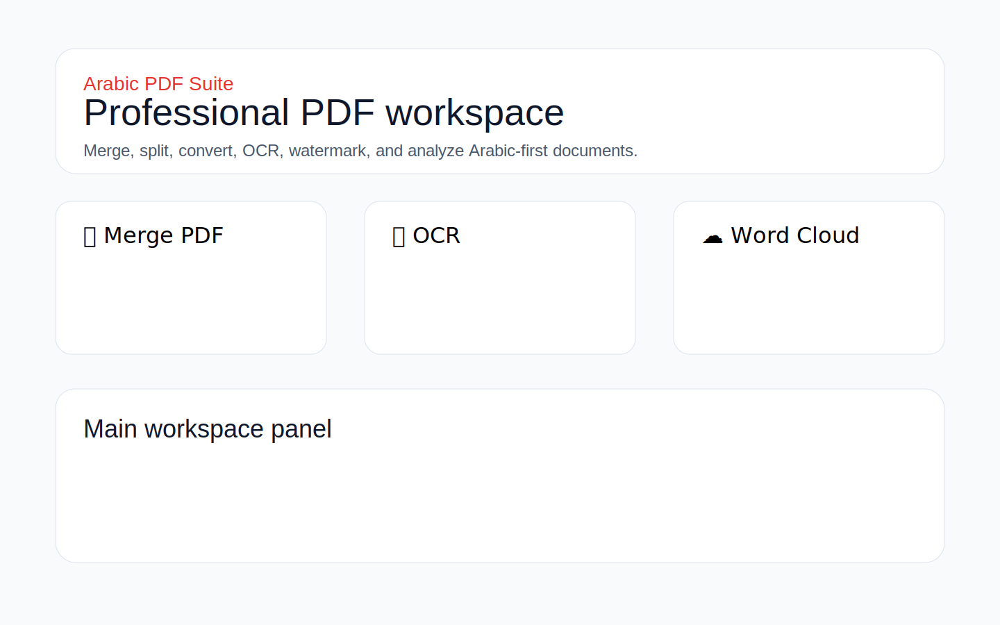
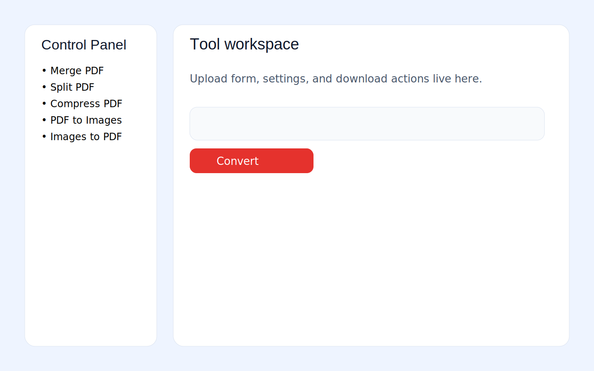

# Arabic PDF Suite


Arabic PDF Suite is a polished, Arabic-first document workspace inspired by the clean utility flow of ILovePDF.com.

It handles the boring, annoying PDF jobs properly: merge, split, compress, convert, OCR, watermark, reorder, and generate Arabic word clouds from document content.

## What’s included

### PDF + document tools
- Merge PDF
- Split PDF
- Compress PDF
- PDF to Images
- Images to PDF
- Word to PDF
- PDF to Word
- Add Watermark
- Rotate Pages
- Delete Pages
- Reorder Pages
- OCR (Arabic + English)
- Arabic Word Cloud
- PDF to Excel
- Excel to PDF

## Product highlights
- Modern card-based UI
- Cleaner single-workspace flow instead of tab chaos
- Arabic-first text handling
- OCR-ready on Docker or local installs with system packages
- Port 3000 default for easier hosting
- Desktop packaging scaffolding for Windows, macOS, and Linux
- Install scripts for Windows and Unix
- Screenshot assets and capture script

## Screenshots

### Home


### Workspace


> Replace the placeholder SVGs with live captures by running `python scripts/capture_screenshots.py` and grabbing browser shots from the local app.

## Quick start

### Local run
```bash
chmod +x run.sh
./run.sh
```

Windows:
```bat
run.bat
```

Open: <http://localhost:3000>

### One-line install
```bash
curl -fsSL https://raw.githubusercontent.com/wa1939/arabic-pdf-suite/main/install.sh | bash
```

## Deploy

### Docker Compose
```bash
docker compose up --build
```

### Railway
- Connect the repo
- Use the included `Dockerfile`
- Expose port `3000`

### Vercel
A `vercel.json` scaffold is included for lightweight Python hosting, but full OCR is not recommended on Vercel because Ghostscript and Tesseract are not natural serverless dependencies.

### Render
`render.yaml` is included for Docker deployment.

Full notes: [docs/DEPLOYMENT.md](docs/DEPLOYMENT.md)

## Desktop packaging

### Windows `.exe`
```bash
pyinstaller packaging/pyinstaller.spec
```

### macOS `.app`
```bash
bash packaging/build-macos-app.sh
```

### Linux AppImage / snap
```bash
bash packaging/build-linux-appimage.sh
snapcraft
```

## Local development

### Python deps
```bash
python3 -m venv .venv
source .venv/bin/activate
pip install -r requirements.txt
```

### System deps
Ubuntu / Debian:
```bash
sudo apt-get update
sudo apt-get install -y tesseract-ocr tesseract-ocr-ara tesseract-ocr-eng ghostscript qpdf pngquant libreoffice-writer libreoffice-calc
```

### Run tests
```bash
pytest
```

## Repo structure
```text
arabic-pdf-suite/
├── app.py
├── src/
│   ├── ocr_service.py
│   ├── pdf_tools.py
│   └── text_utils.py
├── tests/
├── docs/
├── packaging/
├── snap/
├── Dockerfile
├── docker-compose.yml
├── railway.json
├── render.yaml
├── vercel.json
├── install.sh
├── install.bat
└── scripts/
```

## Conversion notes
- OCR: best on Docker/local/VPS where Tesseract and Ghostscript are installed.
- PDF to Word: exports extracted text into DOCX when supported, otherwise TXT fallback.
- Word to PDF: pragmatic DOCX/TXT rendering into PDF.
- PDF to Excel: exports one row per extracted text line for reliability.
- Excel to PDF: renders workbook content into a readable PDF summary.

## Privacy
- No signup
- Temporary processing
- Best deployed locally or on your own infrastructure if privacy matters

## Ship checklist
- [x] UI overhaul
- [x] All requested tool flows present
- [x] Docker / Railway / Vercel scaffolding
- [x] Desktop packaging scaffolding
- [x] Install scripts
- [x] README + deployment guide + screenshots folder
- [x] Tests for core backend functions

## Recommended next step
If you want this to compete with ILovePDF visually, the next real upgrade is moving the frontend to Next.js while keeping Python conversion services behind an API. The current Streamlit build is far cleaner than before, but Streamlit still has a ceiling. That’s the honest answer.
